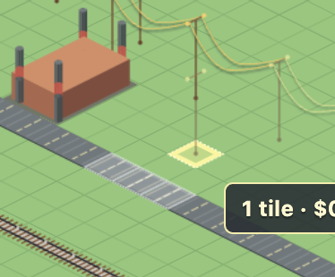

# SynthCity

SynthCity is a deterministic, browser-first city-building sandbox focused on
legible systems, vertical development, and a city that remains interesting to
watch as it grows.

[Play the current production build](https://synth-city.vercel.app/design-review/square-grid-mayor.html?profile=city)



*Roads, rail, buildings, and utility networks in the current sandbox.*

## Build SynthCity with us

SynthCity is an early open-source city builder, and we want more people shaping
what it becomes. If you enjoy simulation design, city-builder strategy, browser
rendering, interface design, visual assets, or testing, there is room for you
here.

- [Play the game](https://synth-city.vercel.app/design-review/square-grid-mayor.html?profile=city)
  and share what you notice.
- Browse [open issues](https://github.com/JimmyThompson1997/SynthCity-Public/issues)
  or start a focused feature discussion.
- Read [CONTRIBUTING.md](CONTRIBUTING.md), run the project locally, and open a
  pull request from your fork.

Small improvements, thoughtful critique, screenshots, and ambitious systems
ideas are all welcome. SynthCity is being built in public, one city system at a
time.

The project is open source under the [MIT License](LICENSE). Bundled third-party
material retains its own license as described in
[THIRD_PARTY_NOTICES.md](THIRD_PARTY_NOTICES.md).

## Current game

The canonical simulation is `MarketCityStateV2`, schema version 2, rules
version `claude-market-2.16.0`, on a fixed 48 x 48 simulation map. The renderer
and interface may frame that map inside a larger visual grid, but simulation
state, saves, hashes, and commands use the canonical 48 x 48 map.

The `claude-market-*` string is a legacy save-compatibility identifier, not
SynthCity product branding or a statement of affiliation.

| System | Current status |
| --- | --- |
| Terrain, elevation, trees, zoning, roads, and avenues | Playable |
| RCI demand, wealth, density, height caps, and deterministic buildings | Playable |
| Component-local power generation and allocation | Playable; lines may cross a Road or Rail tile |
| Water sources, treatment, pipes, coverage, and allocation | Playable |
| Fire ignition, spread, suppression, collapse, and history | Playable |
| Police stations, funding, crime, dereliction, and height effects | Playable |
| Landfill zoning, storage, unmanaged waste, and pollution | Playable |
| Passenger rail, stations, utility gates, and ridership | Playable |
| Subway tunnels and stations | Constructible; no demand or economic effect yet |
| Education, health, and parks | Not gameplay systems yet |

Placement costs are intentionally permissive in the current sandbox. Fixed
taxes and monthly operating expenses can push the treasury negative; loans,
bonds, bankruptcy, and affordability locks are not implemented.

## Run locally

Requirements:

- Node.js 24 or newer
- pnpm 11.16.0 or newer

```sh
corepack enable
pnpm install --frozen-lockfile
pnpm dev
```

Open the URL printed by Vite. The root page redirects to the playable city at
`/design-review/square-grid-mayor.html?profile=city`.

City saves are local to the browser through IndexedDB. There is currently no
account system, cloud-save backend, server database, or telemetry integration
in the runtime.

## Verification

Fast local checks:

```sh
pnpm public:check
pnpm typecheck
pnpm test
```

Full release checks:

```sh
pnpm test:release
```

Hosted release verification additionally requires an exact commit guard:

```sh
SYNTHCITY_REQUIRE_PRODUCTION=1 \
SYNTHCITY_EXPECTED_COMMIT=<commit-sha> \
PLAYWRIGHT_BASE_URL=<deployment-url> \
pnpm test:hosted
```

## Repository map

- `src/market-city/`: canonical rules, state, commands, projections, and monthly
  simulation.
- `src/market-city-dashboard/`: browser controller, persistence, inspector, and
  renderer adapters.
- `design-review/`: playable shell and design-review entry points.
- `public/design-review/`: cleared browser visual modules.
- `tests/`: deterministic unit, property, projection, and browser acceptance
  tests.
- `evidence/`: bounded release receipts generated by scenario checks.

For the simulation contract, read [GAMEPLAY_PRINCIPLES.md](GAMEPLAY_PRINCIPLES.md).
For asset status, read [docs/ASSET_PROVENANCE.md](docs/ASSET_PROVENANCE.md).

## Contributing and security

Contribution expectations are in [CONTRIBUTING.md](CONTRIBUTING.md). General
support guidance is in [SUPPORT.md](SUPPORT.md). Report vulnerabilities through
GitHub private vulnerability reporting as described in [SECURITY.md](SECURITY.md),
never through a public issue.

Feature branches must pass local checks, GitHub CI, hosted preview checks, and
visual review. The merged SHA is verified again on the production URL.

The `private: true` package setting prevents accidental npm publication. It is
independent of GitHub repository visibility.
